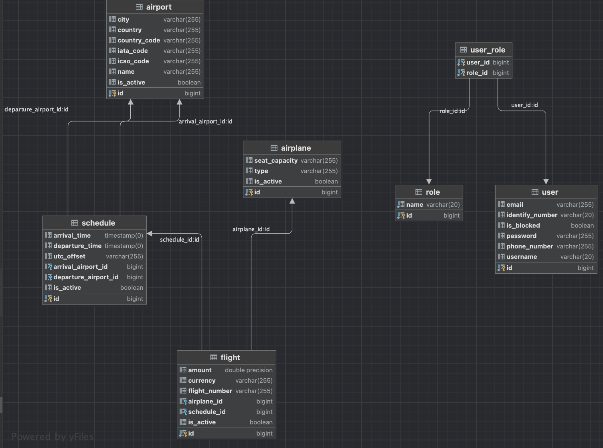
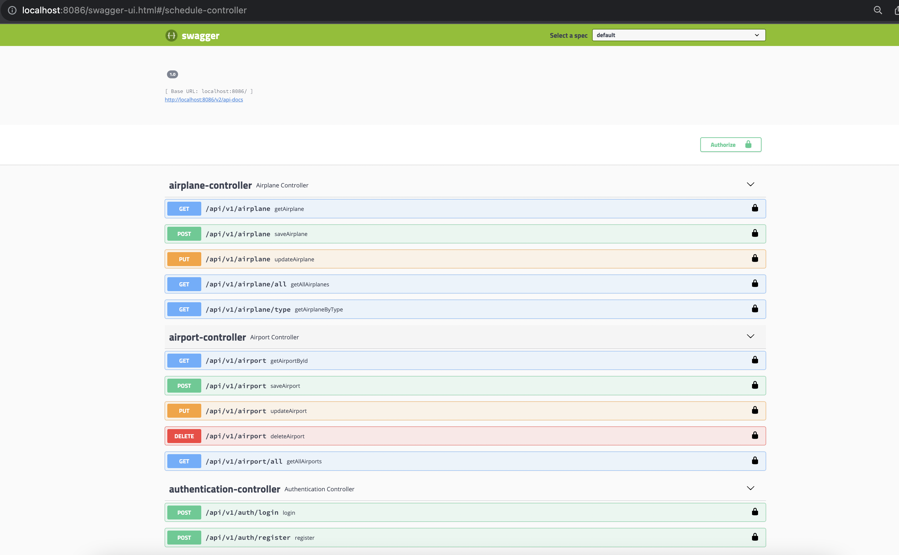
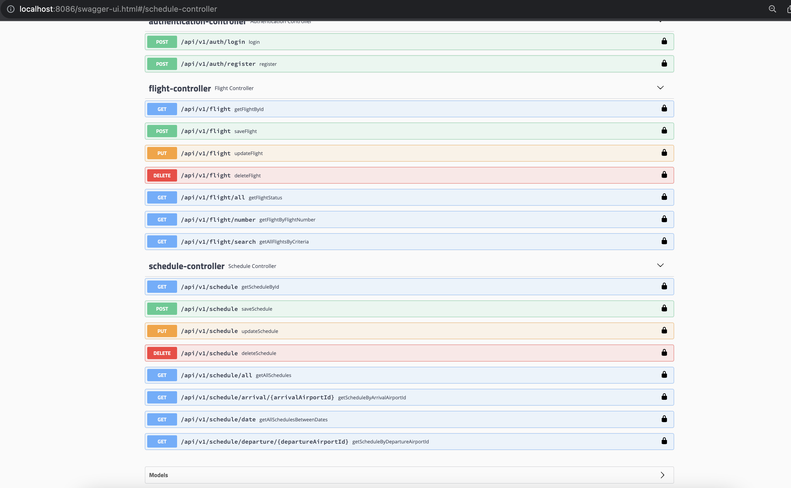
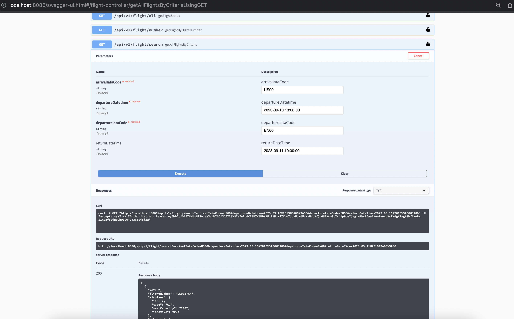
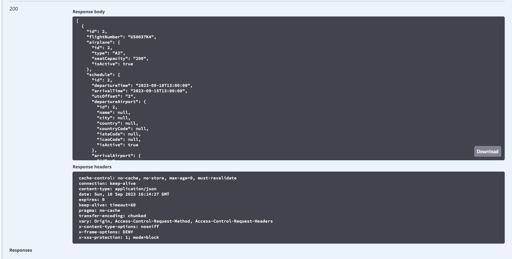

# AMADEUS CASE STUDY

## Used Technologies & Arhitecture & Methods:

* Monolithic Architecture
* Java 17
* Spring Boot 2.6.7
* Spring Security
* Postgres
* JSON Web Token
* Swagger 2.9.2
* Gradle
* Rest Template for Amadeus Flight Offers Search API call


### Swagger endpoint:

`
http://localhost:8086/swagger-ui.html
`

### Data Modeling

Database diagram is as below.  
Created 4 table (airport/airplane/schedule/flight) case scenario and 3 table (user/role/user-roles) for authentication.





### CRUD Structure

Created crud structure for entities.






### SEARCH FLIGHT API 

##### The search flight API checks the departure and arrival dates with the incoming request. If there is an arrival date and the departure date has passed, an error is sent.
##### Airports are found by checking the IATA codes in incoming requests.
##### If the arrival date is entered, a request is made by switching the departure and arrival iata codes for the entered two-way flight information.

Request Information:

```
METHOD: GET
URL: http://localhost:8086
ENDPOINT: /api/v1/flight/search
REQUEST PARAMETERS: 
        String departureIataCode 
        String departureDatetime
        String arrivalIataCode 
        String arrivalDatetime
```

##### example of Search Flight API response in [SearchFlightApiResponse.json](SearchFlightApiResponse.json)

curl of request: 

``` bash
curl --location 'http://localhost:8086/api/v1/flight/search?departureIataCode=EN00&arrivalIataCode=US00&departureDatetime=2023-09-10%2013%3A00%3A00&arrivalDateTime=2023-09-11%2010%3A00%3A00' \
--header 'Authorization: Bearer ***'
```
##

#### Swagger Outputs:







### AUTHENTICATION

###### Authentication handled with JWT and SpringBoot Security. Token expires in 20 mins.
###### There is two role that USER and ADMIN. ADMIN can call every endpoint but USER can not call PUT,DELETE and POST endpoints.


Login request example:

``
curl --location 'http://localhost:8086/api/v1/auth/login' \
--header 'Content-Type: application/json' \
--data '{
"username": "Beyza",
"password": "beyza123"
}'
``


### SCHEDULED BACKGROUND JOB

##### I used scheduled cron jobs in SpringBoot. I searched and try to use AMADEUS Flight Offers Search API. 

For more info: 
[AMADEUS TRAVEL API FOR DEVELOPERS ](https://developers.amadeus.com/self-service/category/flights/api-doc/flight-offers-search/api-reference)


